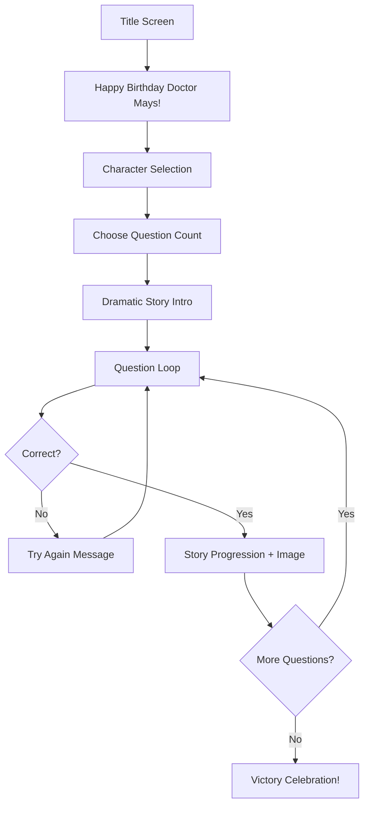

# 🎲 Doctor Mays' Birthday Quest

> *A D&D-inspired trivia adventure celebrating Doctor Mays' birthday with synthwave 80s aesthetics*

---

## 📖 Project Overview

**Doctor Mays' Birthday Quest** is a browser-based trivia game that combines the excitement of Dungeons & Dragons storytelling with personalized trivia questions. Players choose a character and embark on a quest to save the realm by answering questions across multiple knowledge domains—each tailored to the interests of the birthday honoree and their guests.

### Core Features

- **Story-Driven Gameplay**: Each correct answer advances a dramatic fantasy narrative
- **Character Selection**: 5 unique heroes with 80s-inspired D&D aesthetics
- **Configurable Questions**: JSON-based system supporting text, images, audio, and video
- **Responsive Design**: Mobile-first, fully responsive using Flexbox
- **GitHub Pages Ready**: Pure HTML/CSS/JavaScript architecture

---

## 🎯 Game Flow



### Screen Progression

1. **Title Screen** - Game logo with synthwave styling
2. **Birthday Splash** - "Happy Birthday Doctor Mays!" celebration
3. **Character Selection** - Choose from 5 heroes
4. **Question Count Selection** - User picks how many questions (up to available pool)
5. **Story Intro** - Paragraph-by-paragraph dramatic narrative
6. **Gameplay Loop** - Questions with progress bar, story reveals on success
7. **Victory Screen** - Grand finale with celebration visuals

---

## 🧙 Story & Narrative

### The Tale

> *On the eve of Doctor Mays' birthday, a great darkness known as the Shadow of Ignorance threatens to consume the realm of Trivia. Only a hero of wit and wisdom can push back the shadow by conquering the Trials of Knowledge. Each trial solved brings light back to the land and the kingdom closer to the Grand Celebration.*

### Three-Act Structure

| Act | Location | Questions | Theme |
|-----|----------|-----------|-------|
| **Act 1** | The Forgotten Library | 1-7 | Discovery and learning |
| **Act 2** | The Echoing Caverns | 8-14 | Challenge and perseverance |
| **Act 3** | The Shadow Citadel | 15-20 | Triumph and revelation |
| **Finale** | The Grand Hall | — | Birthday celebration feast |

---

## 👥 Playable Characters

| Character | Class | Visual Description | Bio |
|-----------|-------|-------------------|-----|
| **Synth the Sage** | Wizard | Neon purple robes, glowing staff, star-pattern trim | An ancient scholar who channels knowledge through synthwave magic |
| **Blaze Ryder** | Rogue | Leather jacket, mirrored sunglasses, chrome daggers | A quick-witted thief who solves problems with style |
| **Harmony Valor** | Paladin | Chrome armor, boombox-shaped shield, neon sword | A noble warrior whose strength comes from 80s power ballads |
| **Whiskers McFluff** | Ranger | Cat-person, neon-tipped ears, crystalline bow | A feline archer with supernatural perception |
| **Melody Rose** | Bard | Big hair, keytar weapon, sequined cape | A rockstar whose music literally changes reality |

> **Note**: Character selection is cosmetic only—it affects dialogue flavor and portrait images but not gameplay mechanics.

---

## 📝 Question Categories

### Distribution (20 Total Questions)

| Category | Count | Description |
|----------|-------|-------------|
| **Mathematics** | 3 | Difficult math problems requiring calculation |
| **Cat Expertise** | 3 | Questions a cat lover would know |
| **Musicals** | 3 | Broadway and musical theater knowledge |
| **70s/80s Music** | 3 | Classic rock, disco, and synthwave hits |
| **Psychiatry** | 3 | Mental health and psychology concepts |
| **Baseball** | 3 | 70s baseball history and KC Royals |
| **Cooking** | 2 | Culinary techniques and recipes |

### Balanced Sampling Algorithm

When users select fewer than 20 questions, the game proportionally samples from each category while guaranteeing at least 1 question from each (when possible):

```javascript
// Example: User selects 14 questions
// Pool: 20 questions across 7 categories
// Result: ~2 questions per category, ensuring balance
```

This ensures all players have their "star moment" for topics they know well.

---

## ⚙️ Configuration System

### File Structure

```
KevinGame2/
├── index.html
├── style.css
├── game.js
├── gameConfig.json          # Main configuration file
├── validate-questions.js    # Question validation script
├── assets/
│   ├── characters/
│   │   ├── synth_sage.png
│   │   ├── blaze_ryder.png
│   │   ├── harmony_valor.png
│   │   ├── whiskers_mcfluff.png
│   │   └── melody_rose.png
│   ├── story/
│   │   ├── intro_01.png
│   │   ├── act1_scene01.png
│   │   └── ...
│   ├── questions/
│   │   ├── images/
│   │   ├── audio/
│   │   └── video/
│   └── ui/
│       ├── background.png
│       ├── progress_bar.png
│       └── buttons/
└── README.md
```

### gameConfig.json Schema

```json
{
  "meta": {
    "title": "Doctor Mays' Birthday Quest",
    "birthdayMessage": "Happy Birthday Doctor Mays!",
    "version": "1.0.0",
    "storyIntro": [
      "In a realm where knowledge is power...",
      "A shadow has fallen across the land...",
      "Only one hero can save us..."
    ]
  },
  
  "characters": [
    {
      "id": "synth_sage",
      "name": "Synth the Sage",
      "class": "Wizard",
      "imagePath": "assets/characters/synth_sage.png",
      "bio": "An ancient scholar who channels knowledge through synthwave magic"
    }
  ],
  
  "categories": [
    {
      "id": "cats",
      "name": "Cat Expertise",
      "icon": "🐱",
      "questions": [
        {
          "id": "cats_01",
          "enabled": true,
          "status": "complete",
          "text": "What breed is known for its folded ears?",
          "answers": ["Scottish Fold", "Persian", "Siamese", "Maine Coon"],
          "correctIndex": 0,
          
          "media": {
            "image": null,
            "audio": null,
            "video": null
          },
          
          "requiredMedia": {
            "image": { "needed": false, "description": null },
            "audio": { "needed": false, "description": null },
            "video": { "needed": false, "description": null }
          },
          
          "storyProgression": "The hero recognizes the ancient cat guardian...",
          "progressionImage": "assets/story/act1_scene02.png",
          
          "author": "Human",
          "dateCreated": "2026-01-18"
        }
      ]
    }
  ]
}
```

### Question Status Values

| Status | Description | Game Behavior |
|--------|-------------|---------------|
| `complete` | Ready to play | Included in question pool |
| `draft` | Text done, needs review | Excluded unless testing |
| `needs-media` | Waiting on assets | Excluded from pool |
| `disabled` | Manually turned off | Excluded from pool |

### Media Requirements (For AI Agents)

When creating questions that require media assets, populate the `requiredMedia` object:

```json
{
  "id": "music80s_02",
  "enabled": false,
  "status": "needs-media",
  "text": "Listen to this clip. What year was this song released?",
  "answers": ["1983", "1984", "1985", "1986"],
  "correctIndex": 1,
  
  "media": {
    "audio": null
  },
  
  "requiredMedia": {
    "audio": {
      "needed": true,
      "description": "A 10-15 second clip of 'Jump' by Van Halen (intro synth section preferred)"
    }
  }
}
```

This allows AI agents to create complete question text while flagging what assets a human needs to provide.

---

## 🎨 Visual Design System

### Color Palette (Synthwave 80s)

| Name | Hex | Usage |
|------|-----|-------|
| Deep Space | `#0d0221` | Primary background |
| Neon Purple | `#541388` | Secondary background |
| Hot Pink | `#f72585` | Accent, buttons hover |
| Electric Blue | `#4361ee` | Links, progress bar |
| Chrome Silver | `#e0e0e0` | Text, borders |
| Sunset Orange | `#ff6b35` | Correct answer glow |
| Laser Red | `#d00000` | Wrong answer flash |

### Typography (Google Fonts)

| Font | Usage |
|------|-------|
| `Orbitron` | Headers, titles, UI labels |
| `Press Start 2P` | Pixel-style accents, retro text |
| `Inter` | Body text, questions, answers |

### Visual Effects

- **Neon Glow**: CSS `box-shadow` with multiple spread values
- **Gradient Backgrounds**: Linear gradients (purple → pink → orange)
- **Scanlines**: CSS pseudo-element overlay (optional)
- **Button Hover**: Scale transform + glow intensification
- **Wrong Answer**: Red flash + shake animation
- **Correct Answer**: Green glow + particle burst (CSS animation)

---

## 📱 Responsive Design

### Breakpoints

| Size | Width | Layout Adjustments |
|------|-------|-------------------|
| Mobile | < 480px | Single column, stacked answers, larger touch targets |
| Tablet | 480-768px | Two-column answers, side margins |
| Desktop | > 768px | Full layout, decorative elements visible |

### Flexbox Strategy

```css
.question-container {
  display: flex;
  flex-direction: column;
  align-items: center;
  gap: 1rem;
}

.answers-grid {
  display: flex;
  flex-wrap: wrap;
  justify-content: center;
  gap: 0.75rem;
}

.answer-btn {
  flex: 1 1 calc(50% - 0.5rem);
  min-width: 200px;
  min-height: 48px; /* Touch-friendly */
}
```

### Media Rendering

- **Images**: Max-width 100%, auto height, centered
- **Audio**: Native HTML5 `<audio>` with custom-styled controls
- **Video**: 16:9 aspect ratio container, max-width 100%

---

## 🔧 Development Phases

### Phase 1: Foundation ⬜
- [ ] Create `index.html` base structure
- [ ] Implement `style.css` with design system
- [ ] Create `gameConfig.json` with sample data
- [ ] Build basic `game.js` game loop

### Phase 2: Core Gameplay ⬜
- [ ] Character selection screen
- [ ] Question count selection
- [ ] Question rendering (text only)
- [ ] Answer validation
- [ ] Progress bar
- [ ] Story progression between questions

### Phase 3: Media Support ⬜
- [ ] Image question support
- [ ] Audio player integration
- [ ] Video player integration
- [ ] Responsive media containers

### Phase 4: Polish ⬜
- [ ] Story intro sequence
- [ ] Victory celebration screen
- [ ] Animations (correct/wrong)
- [ ] Sound effects
- [ ] Transition effects

### Phase 5: Content ⬜
- [ ] Write all 20 questions
- [ ] Generate character images
- [ ] Generate story progression images
- [ ] Source/create media for audio/video questions
- [ ] Run validation script

### Phase 6: Testing & Deployment ⬜
- [ ] Cross-browser testing
- [ ] Mobile device testing
- [ ] GitHub Pages deployment
- [ ] Final validation

---

## 🛠️ Technical Requirements

### Stack

| Technology | Purpose |
|------------|---------|
| HTML5 | Structure and semantics |
| CSS3 | Styling, Flexbox layout, animations |
| JavaScript (ES6+) | Game logic, state management |
| Bootstrap 5 | Grid utilities, responsive helpers |
| Google Fonts | Typography |
| JSON | Configuration storage |

### Browser Support

- Chrome 90+
- Firefox 88+
- Safari 14+
- Edge 90+
- Mobile Safari (iOS 14+)
- Chrome Mobile (Android 10+)

### Hosting

GitHub Pages static hosting (no server-side code required)

---

## ✅ Question Validation

Run the validation script to check configuration status:

```bash
# Open in browser or run with Node.js
node validate-questions.js
```

### Expected Output

```
=== Question Validation Report ===

✅ COMPLETE (18 questions ready)
   - cats_01, cats_02, cats_03
   - math_01, math_02, math_03
   - musicals_01, musicals_02, musicals_03
   ...

⚠️ NEEDS MEDIA (2 questions awaiting assets)
   - music80s_02: Missing AUDIO
     → "A 10-15 second clip of 'Jump' by Van Halen"
   - cooking_01: Missing IMAGE  
     → "Photo of properly julienned vegetables"

❌ DISABLED (0 questions manually disabled)

📊 Summary: 18/20 questions ready (90%)
```

---

## 📋 Content Checklist

### Questions to Create

- [ ] **Math (3)**: 3 difficult calculation problems
- [ ] **Cats (3)**: Breed identification, behavior, fun facts
- [ ] **Musicals (3)**: Broadway shows, songs, actors
- [ ] **70s/80s Music (3)**: Artists, albums, song identification
- [ ] **Psychiatry (3)**: DSM concepts, therapeutic approaches, theorists
- [ ] **Baseball (3)**: 70s history, Royals team facts
- [ ] **Cooking (2)**: Techniques, ingredients, recipes

### Assets to Generate

- [ ] 5 character portraits (synthwave fantasy style)
- [ ] Title screen background
- [ ] Story intro images (3-5 scenes)
- [ ] Act transition images (3 acts)
- [ ] Victory celebration image
- [ ] UI elements (buttons, progress bar, frames)

---

## 🎮 Gameplay Mechanics

### Wrong Answer Handling

- Display dramatic "The shadows grow stronger..." message
- Brief shake animation on question container
- Answer buttons reset (player must try again)
- No penalty—infinite retries allowed

### Progress Tracking

```javascript
gameState = {
  currentQuestion: 0,
  correctAnswers: 0,
  totalQuestions: 20,      // Or user-selected count
  selectedCharacter: null,
  currentAct: 1,
  storyProgress: []
}
```

### Progress Bar

- Fixed position at top of viewport
- Shows: `[Character Portrait] ████████░░░░░░ 8/20 Questions`
- Updates on each correct answer
- Color shifts from blue → purple → pink as progress increases

---

## 🚀 Quick Start (For Developers)

1. Clone the repository
2. Open `gameConfig.json` and review structure
3. Run `validate-questions.js` to check content status
4. Edit questions in their respective categories
5. Add media files to `assets/questions/`
6. Test locally by opening `index.html`
7. Deploy to GitHub Pages

---

## 📄 License

This project is a personal birthday gift and is not intended for commercial use.

---

**Happy Birthday, Doctor Mays! 🎂🎉**
